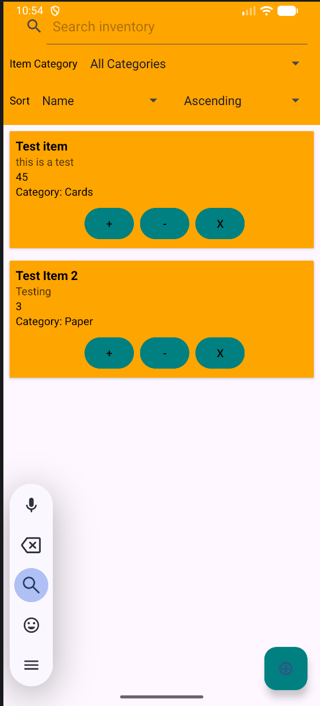
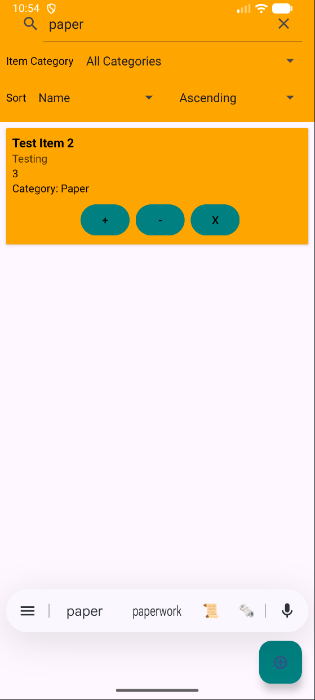
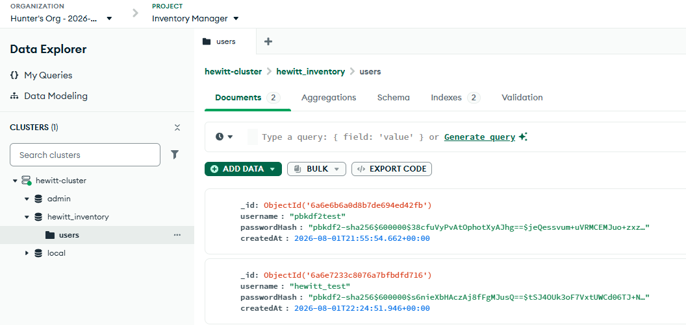
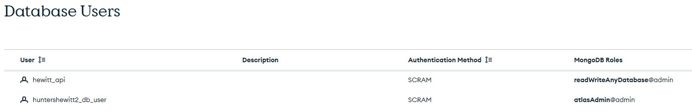

# Computer Science Capstone ePortfolio

```markdown
## Portfolio Contents

- [Professional Self-Assessment](#professional-self-assessment)
- [Code Review](#code-review)
- [Original Artifact](#original-artifact)
- [Enhancement One: Software Design and Engineering](#enhancement-one-software-design-and-engineering)
- [Enhancement Two: Algorithms and Data Structures](#enhancement-two-algorithms-and-data-structures)
- [Enhancement Three: Databases](#enhancement-three-databases)
- [Course Outcomes](#course-outcomes)
```

## Professional Self-Assessment

Welcome to my professional ePortfolio. This portfolio demonstrates my growth in software design, engineering, algorithms, databases, security, and professional communication. Throughout my computer science program, I have developed technical and professional skills that have improved on my existing understanding of software development and problem solving. Completing my coursework and working through the sections of this ePortfolio allowed me to reflect on how my abilities as a computer science professional have progressed. From simply creating functional programs to considering maintainability, usability, security, and stakeholder needs, these experiences have helped shape my professional goal of becoming a database administrator who can create practical solutions while learning new technology and approaches.

The work that I have done during my courses has strengthened my ability to communicate and collaborate within a professional computer science environment. Although many of my assignments were independent of each other, I constantly had to approach them from the different perspectives of the software development lifecycle such as a developer, user, or stakeholder. For example, while working through the development process for the Travlr Getaways web application, the business requirements needed to be translated into website features that supported both customers and administrators. Building design documents and writing technical explanations gave me experience communicating technical information clearly to audiences with varying degrees of technical knowledge.

As I continued to develop skills in data structures and algorithms, I was exposed to several different programming languages such as Javascript, Python, and SQL through different development environments and projects. Reinforcement learning projects further strengthened my understanding of algorithms by requiring me to apply concepts like deep Q-learning, neural networks, and pathfinding. Throughout the projects and environments, I learned to consider not only whether a solution would work, but also if that solution was efficiently organized, processed, and maintained.

Another important area that I have improved my knowledge and skills in is software security. Throughout the different projects, such as the Artemis Financial application and other security-focused coursework, I worked with concepts such as secure communication, access control, and the principle of least privilege. The culmination of these experiences has reinforced the importance of implementing security into the different aspects of the software development life cycle instead of just a single section of it. Designing software with security in mind protects user information and company assets, and is now part of my core values as a professional in the technology field.

Developing this ePortfolio has allowed me to synthesize the skills and knowledge gained throughout my coursework while revisiting an application I created earlier in the program. I was able to identify areas that needed improvement and revisited my work through a more experienced perspective. I used those skills to then demonstrate how my approach to software development has changed and how I now come to a solution to a problem with a better understanding of the structure, security, and maintainability of the software. 

The artifact versions that follow demonstrate this growth through enhancements to an inventory management application built in the mobile app development course. These enhancements address software design and engineering, algorithms and data structures, and databases while improving the security of the application. Each enhancement focuses on different aspects of computer science and software development; they come together to build a secure, functional, and efficient application. The original artifact and its enhanced versions are evidence of my ability to evaluate existing software, identify opportunities for improvement, and apply the knowledge and skills developed throughout the computer science program.


## Code Review

Before I started working on enhancing my chosen artifact, I performed an informal code review of the original artifact. This code review examines the existing code and analyzes it based on its existing design, functionality, and opportunities for improvement. Since I decided to work on one artifact for all three enhancements, I have evaluated different sections of the original artifact that are relevant to the planned enhancements.

[](https://www.youtube.com/watch?v=JozCU0tl3H0)

**[Watch the Code Review on YouTube](https://www.youtube.com/watch?v=JozCU0tl3H0)**

## Original Artifact

### Artifact Overview

**Artifact:** Inventory Management Application
**Originating Course:** CS360: Mobile Architect and Programming
**Date Created:** April 23rd, 2026

The artifact that I worked with in this milestone is an inventory management application that I developed while in my mobile application development and design course at SNHU. The final version of this application was completed in April of 2026. This inventory application had a fairly simple set of goals it was required to meet: user logins, a dynamic item inventory, and SMS notifications. By the end of my course, I had most of the application functional, and I was able to use it as a basic inventory application with minimal security and database functionality.

[View/Download the Original Artifact](https://drive.google.com/file/d/1T-IAxeNr_OrOkWOkgyjRKiF2CE_FIZaL/view?usp=drive_link)

# Enhancement One: Software Design and Engineering

## Enhancement Narrative

I chose to work on this artifact for this milestone and all of the milestones because I found the process of working through mobile applications entertaining. I discovered there was plenty of room for improvement in this application after reflecting on it with my increased knowledge of security and databases since that course. I would also like to be able to use this application to assist a hobby of mine, and I plan to eventually introduce more features that will better support my hobby. Mobile application development introduces multiple different software languages in a single environment. This inventory application uses at least three different languages: JavaScript, XML, and SQLite/C. Having multiple languages in a single application demonstrates my ability to switch between languages and their nuances, while showing that I can combine them to create a functional application. 

In this milestone, I focused on user authentication by changing the behavior of the user login function and adding a salted password hasher for protective password storage. Originally, the design of the login screen was built around a user logging into the application with their credentials. The application would check the credentials against the stored credentials in the database, and if they were a match, the screen would switch to the main menu. The only validation test was to check if the credentials matched, but now I have added checks for a blank username or password, password length requirements, and pre-existing usernames. 

The application now also stores login sessions, so the user stays logged in until the session is cleared or the user logs out, rather than starting at the login screen every time the application is launched. The application also now salts and hashes user passwords before storing them into the Room SQLite database. I chose to use OWASP’s recommended salted hash of PDKDF2-SHA256 with 600,000 iterations.

## Code Changes

### Example 1: Salted and Hashed Password Storage

**Original Code**

```java
public class RegisterActivity extends AppCompatActivity {

    EditText usernameInput, passwordInput;
    Button registerButton;

    AppDatabase db;

    @Override
    protected void onCreate(Bundle savedInstanceState) {
        super.onCreate(savedInstanceState);
        setContentView(R.layout.activity_register);

        usernameInput = findViewById(R.id.usernameInput);
        passwordInput = findViewById(R.id.passwordInput);
        registerButton = findViewById(R.id.registerButton);

        db = AppDatabase.getInstance(this);

        registerButton.setOnClickListener(view -> {
            String username = usernameInput.getText().toString();
            String password = passwordInput.getText().toString();

            User user = new User(username, password);
            db.userDao().insert(user);

```

**Enhanced Code**

```java
public class RegisterActivity extends AppCompatActivity {
    private static final String TAG = "RegisterActivity";

    EditText usernameInput, passwordInput;
    Button registerButton;

    AuthenticationRepository authenticationRepository;
    // keeps password hashing and database work off the main thread
    private final ExecutorService authenticationExecutor =
            Executors.newSingleThreadExecutor();

    @Override
    protected void onCreate(Bundle savedInstanceState) {
        super.onCreate(savedInstanceState);
        setContentView(R.layout.activity_register);

        usernameInput = findViewById(R.id.usernameInput);
        passwordInput = findViewById(R.id.passwordInput);
        registerButton = findViewById(R.id.registerButton);

        authenticationRepository = AuthenticationProvider.create(this);

        // validates and creates the account in the background
        registerButton.setOnClickListener(view -> {
            String username = usernameInput.getText().toString();
            String password = passwordInput.getText().toString();

            // prevents duplicate registration requests
            registerButton.setEnabled(false);
            authenticationExecutor.execute(() -> {
                try {
                    AuthenticationRepository.Result result =
                            authenticationRepository.register(username, password);

                    // returns the registration result to the main thread
                    runOnUiThread(() -> showRegistrationResult(result));
                } catch (RuntimeException exception) {
                    Log.e(TAG, "Registration failed", exception);
                    runOnUiThread(this::showRegistrationError);
                }
            });
        });

    }
```

```java
public final class AuthenticationProvider {
    private AuthenticationProvider() {
    }

    public static AuthenticationRepository create(Context context) {
        return new AuthenticationRepository(
                new RoomUserStore(
                        AppDatabase.getInstance(context).userDao(),
                        new PasswordHasher()),
                new SharedPreferencesSessionStore(context)
        );
    }
}
```

```java
public final class PasswordHasher {

    private static final String ALGORITHM = "PBKDF2WithHmacSHA256";
    private static final String FORMAT_NAME = "pbkdf2-sha256";

    // configures the PBKDF2 work factor, salt size, and hash size
    private static final int ITERATIONS = 600_000;
    private static final int SALT_BYTES = 16;
    private static final int HASH_BYTES = 32;

    private final SecureRandom secureRandom = new SecureRandom();


    // creates a new salted hash for database storage
    public String hash(String password) {
        if (password == null || password.isEmpty()) {
            throw new IllegalArgumentException("Password cannot be null or empty");
        }

        byte[] salt = new byte[SALT_BYTES];
        // creates a unique random salt for every stored password
        secureRandom.nextBytes(salt);

        byte[] derivedHash = derive(password, salt, ITERATIONS);

        // stores the algorithm, iterations, salt, and hash in one value
        return FORMAT_NAME
                + "$" + ITERATIONS
                + "$" + encode(salt)
                + "$" + encode(derivedHash);
    }

    // checks an entered password against a stored salted hash
    public boolean verify(String password, String storedValue) {
        if (password == null || storedValue == null) {
            return false;
        }

        try {
            String[] fields = storedValue.split("\\$", -1);

            // rejects values that do not match the expected storage format
            if (fields.length != 4 || !FORMAT_NAME.equals(fields[0])) {
                return false;
            }

            int iterations = Integer.parseInt(fields[1]);

            // prevents malformed values from requesting excessive work
            if (iterations != ITERATIONS) {
                return false;
            }

            byte[] salt = decode(fields[2]);
            byte[] expectedHash = decode(fields[3]);

            if (salt.length != SALT_BYTES || expectedHash.length != HASH_BYTES) {
                return false;
            }

            byte[] suppliedHash = derive(password, salt, iterations);

            // compares hashes without revealing where they differ
            return MessageDigest.isEqual(expectedHash, suppliedHash);
        } catch (IllegalArgumentException exception) {
            // treats malformed numbers and Base64 as failed verification
            return false;

        }
    }

    private byte[] derive(String password, byte[] salt, int iterations) {
        PBEKeySpec specification = new PBEKeySpec(
                password.toCharArray(),
                salt,
                iterations,
                HASH_BYTES * 8
        );

        try {
            SecretKeyFactory factory = SecretKeyFactory.getInstance(ALGORITHM);
            return factory.generateSecret(specification).getEncoded();
        } catch (GeneralSecurityException exception) {
            throw new IllegalStateException(
                    "Cannot derive hash from password",
                    exception
            );
        } finally {
            // clears the password copy held by the key specification
            specification.clearPassword();
        }
    }

    private String encode(byte[] value) {
        return Base64.encodeToString(value, Base64.NO_WRAP);
    }

    private byte[] decode(String value) {
        return Base64.decode(value, Base64.NO_WRAP);
    }
}
```

**What Changed?**

The changes made in this section were to rebuild the registration activity in the application. This rebuild changed the method from raw username and password storage in the SQLite database local to the application to running the entered password through a password hashing algorithm that encrypted the password using PBKDF2-SHA256, as recommended by Android standards.

### Example 2: Login Activity using Hashed Passwords

**Original Code**

```java
public class LoginActivity extends AppCompatActivity {

    // --- UI Elements ---
    private EditText usernameInput;
    private EditText passwordInput;
    private Button submitButton;
    private Button createAccountButton;

    // --- Database ---
    private AppDatabase db;

    @Override
    protected void onCreate(Bundle savedInstanceState) {
        super.onCreate(savedInstanceState);
        setContentView(R.layout.login_screen);

        // Initialize UI components
        usernameInput = findViewById(R.id.username);
        passwordInput = findViewById(R.id.password);
        submitButton = findViewById(R.id.submit_button);
        createAccountButton = findViewById(R.id.create_account_button);

        // Get database instance
        db = AppDatabase.getInstance(this);

        // Login button logic
        submitButton.setOnClickListener(view -> {
            String username = usernameInput.getText().toString();
            String password = passwordInput.getText().toString();

            // Check credentials against database
            User user = db.userDao().login(username, password);

            if (user != null) {
                Toast.makeText(this, "Login successful", Toast.LENGTH_SHORT).show();
                // Navigate to Main Menu on success
                startActivity(new Intent(this, MainMenuActivity.class));
            } else {
                Toast.makeText(this, "Invalid username or password", Toast.LENGTH_SHORT).show();
            }
        });

        // Navigate to Registration screen
        createAccountButton.setOnClickListener(view -> {
            startActivity(new Intent(this, RegisterActivity.class));
        });
    }
}
```

**Enhanced Code**

```java
public class LoginActivity extends AppCompatActivity {
    private static final String TAG = "LoginActivity";

    // stores the login screen controls
    private EditText usernameInput;
    private EditText passwordInput;
    private Button submitButton;
    private Button createAccountButton;

    private AuthenticationRepository authenticationRepository;
    // keeps password verification and database work off the main thread
    private final ExecutorService authenticationExecutor =
            Executors.newSingleThreadExecutor();

    @Override
    protected void onCreate(Bundle savedInstanceState) {
        super.onCreate(savedInstanceState);
        setContentView(R.layout.login_screen);

        // connects the login screen controls
        usernameInput = findViewById(R.id.username);
        passwordInput = findViewById(R.id.password);
        submitButton = findViewById(R.id.submit_button);
        createAccountButton = findViewById(R.id.create_account_button);

        authenticationRepository = AuthenticationProvider.create(this);

        // skips login when a valid session already exists
        if (authenticationRepository.isSessionActive()) {
            openMainMenu();
            return;
        }

        // validates the credentials in the background when login is submitted
        submitButton.setOnClickListener(view -> {
            String username = usernameInput.getText().toString();
            String password = passwordInput.getText().toString();

            // prevents duplicate requests while authentication is running
            setAuthenticationControlsEnabled(false);
            authenticationExecutor.execute(() -> {
                try {
                    AuthenticationRepository.Result result =
                            authenticationRepository.login(username, password);

                    // returns the authentication result to the main thread
                    runOnUiThread(() -> showLoginResult(result));
                } catch (RuntimeException exception) {
                    Log.e(TAG, "Login failed", exception);
                    runOnUiThread(this::showLoginError);
                }
            });
        });

        // opens the registration screen
        createAccountButton.setOnClickListener(view -> {
            startActivity(new Intent(this, RegisterActivity.class));
        });
    }
```

**What Changed?**

The changes made in this section were to adjust the login activity from using the raw passwords entered by the user during login to encrypting the password and comparing the hashed password with the stored password from registration. I also changed the behavior of the application to use session handling, meaning after the user successfully logs into the application, a session is created. While the session is active, the application will reopen to the main menu after being closed and reopened. Before, the app would reopen to the login screen each time it was closed. The session will end when the user logs out.

### Reflection and Course Outcomes

Using my experience and newfound knowledge in security and OWASP standards, I learned a lot more about how this application’s login system could be improved and secured. I discovered how session handling works in Android applications and how to use Android's SecretKeyFactory to generate the salted hashed passwords using API version 26. I also got more acquainted with OWASP’s Password Storage Cheat Sheet to help me choose the parameters for the iterations, salt, and hash. I encountered challenges while learning how to implement these features and security standards because I needed to add an entirely new section to my application to handle session handling and password hashing.

After receiving feedback on my Milestone One assignment, I decided I needed to take a different route with this enhancement. I still improved the security of the application, but instead of working on the database itself, I changed the functionality of the user login, while adding proper input validation and duplicate account checks, as well as setting up a salted password hasher to protect the user account information while being transmitted and stored. This enhancement now covers course outcomes three, four, and five instead of just four and five as originally planned.

[View/Download the First Enhanced Artifact](https://drive.google.com/file/d/1lIlcmrv7jfEcfv-KW5ZK9m8W65oJcy8f/view?usp=drive_link)

# Enhancement Two: Algorithms and Data Structures

## Enhancement Narrative

I chose this artifact for all three enhancement categories because I could see several areas where the original application could be improved to better showcase my skills and meet the course outcomes. For this enhancement, I focused on improving the organization and usability of the inventory list. Originally, the application pulled item data from the database into a List and displayed it using Android's RecyclerView. While this worked for a small inventory, the list was unsorted, unorganized, and did not include any search or filtering capabilities. As the inventory grew, finding and updating a specific item would become increasingly time-consuming.

To improve this, I added a category field to the Item table so users can assign categories to their inventory items. I also created a case-insensitive search bar that allows users to search by item name, description, or category. In addition, I added a category filter and sorting options that allow the inventory to be organized by name, category, or quantity in either ascending or descending order. The available categories are retrieved dynamically from the inventory and organized using a LinkedHashMap, which allows efficient key-based access while maintaining a predictable order.

Together, these changes make the inventory easier to navigate and more practical as the amount of stored data increases. This enhancement also demonstrates my ability to modify an existing database structure, work with data collections, implement searching, sorting, and filtering logic, and improve the overall usability and scalability of an application.

### Example 1: Category Field to Items

**Original Code**

```java
@Entity(tableName = "items")
public class Item {

    @PrimaryKey(autoGenerate = true)
    public int id;

    @NonNull
    public String name;
    public String description;
    public int quantity;

    public Item(@NonNull String name, String description, int quantity) {
        this.name = name;
        this.description = description;
        this.quantity = quantity;
    }

    public String getName() {
        return name;
    }

    public String getDescription() {
        return description;
    }

    public int getQuantity() {
        return quantity;
    }
}
```

**Enhanced Code**

```java
@Entity(tableName = "items")
public class Item {

    @PrimaryKey(autoGenerate = true)
    public int id;

    @NonNull
    public String name;
    public String description;
    public int quantity;
    @NonNull
    public String tag;

    public Item(@NonNull String name, String description, int quantity, @NonNull String tag) {
        this.name = name;
        this.description = description;
        this.quantity = quantity;
        this.tag = tag;
    }

    public String getName() {
        return name;
    }

    public String getDescription() {
        return description;
    }

    public int getQuantity() {
        return quantity;
    }

    public String getTag() {
        return tag;
    }
}
```

**What Changed?**

The changes made in this example are adding the additional "tag" field to the items table, along with an appropriate getTag() method to obtain the tag information from the table.

### Example 2: Search Bar for Inventory Screen

**Enhanced Code**

```java
// applies the current controls and displays the matching items
    private void displayProcessedItems() {
        if (db == null || categorySpinner.getAdapter() == null) {
            return;
        }

        InventoryItemProcessor.SortField sortField = getSelectedSortField();
        boolean ascending = sortDirectionSpinner.getSelectedItemPosition() == 0;
        List<Item> displayedItems = InventoryItemProcessor.process(
                allItems,
                inventorySearch.getQuery().toString(),
                getSelectedCategory(),
                sortField,
                ascending
        );

        itemAdapter = new ItemAdapter(displayedItems, db, this::refreshItemList);
        recyclerView.setAdapter(itemAdapter);
    }
```
```xml
<SearchView
            android:id="@+id/inventorySearch"
            android:layout_width="match_parent"
            android:layout_height="wrap_content"
            android:iconifiedByDefault="false"
            android:queryHint="@string/search_inventory" />
```

**What Changed?**

I added a section to the InventoryActivity class that manages the Search function in the application, with an accompanying Search field to the Application's Layout XML for the Inventory Screen.

<p align="center">
  
  
</p>

### Reflection and Course Outcomes

With these enhancements, I solidified my learning on working more with Android UI and setting up more features to work with data, such as filtering, sorting, and searching. I enjoyed setting up the dynamic categories that allow for much better viewing and management of the inventory and understand the value of improving usability of the application for the end user. One of the challenges I faced in this enhancement was deciding whether to implement an individual tag creation section for the items that are selectable during the item creation process or to just leave it as free text. I decided that free text was better, as adding a different creation section for just the category tags was more work than necessary.

Following instructor feedback, I changed the scope of my enhancement on this category to better meet course outcomes and the category. With this enhancement, I believe I have met course outcomes two, three, and four. Originally, my plan for this category was not in line with what was expected, and I had to re-evaluate my plan when I went through the code review. With these enhancements, I have met the expected course outcomes I set forth at that point in my coursework.

[View/Download the Second Enhanced Artifact](https://drive.google.com/file/d/1TcVglGQS2HwLKq5z6YFjXaG_N7S6JgLx/view?usp=drive_link)

# Enhancement Three: Databases

## Enhancement Narrative

For this final enhancement, I chose to work on the same artifact because I know it allowed me to grow my skills in connecting databases to applications and migrating between different databases. With this artifact, user accounts and item inventory were stored in a single SQLite database created locally on the Android device. 

After my enhancements, I have separated the user accounts and the item inventory into two different databases, one as a MongoDB and the other as SQLite. The user account data was stored locally on the phone and posed a security risk if a threat actor wanted to gain unauthorized access to the application. By moving the user accounts to a MongoDB created through MongoDB Atlas and stored in the cloud, the database becomes more secure by not being accessible directly on the device. 

During this enhancement, I needed to build out a small Node.js/Express server that takes over the registration and login functionality of the application. Now, whenever a new user is created or an existing user logs in, the requests are sent through the server, into an API, and then run on the MongoDB hosted through Atlas. The user passwords are still salted and hashed locally on the device with PBKDF2-SHA256; however, the encryption process has been shifted to the Node/Express server using Android’s Crypto library. The app's item inventory is still locally stored in SQLite and still features searching, filtering, and sorting as previously implemented. By moving accounts to a cloud-stored database, this also enables remote management of the user accounts for the application.

## Code Changes

### Example 1: Creating a MongoDB Atlas Database




**What Changed?**

To support the remotely stored User table, I needed to create a cloud-hosted MongoDB database. MongoDB Atlas offers free-tier hosting options, and I used this with the standard setup to create a database cluster. I created a separate API user for accessing the database and connected to the database using the provided URI from MongoDB.

### Example 2: Creating an API for the User Database

**Enhanced Code**

```java
public final class ApiUserStore implements UserStore {
    private final String baseUrl;

    public ApiUserStore(String baseUrl) {
        this.baseUrl = baseUrl;
    }

    @Override
    public boolean credentialsMatch(String username, String password) {
        int statusCode = post("/login", username, password);

        if (statusCode == HttpURLConnection.HTTP_OK) {
            return true;
        }

        if (statusCode == HttpURLConnection.HTTP_UNAUTHORIZED) {
            return false;
        }

        throw new IllegalStateException(
                "Unexpected login response: " + statusCode
        );
    }

    @Override
    public CreateUserResult createUser(String username, String password) {
        int statusCode = post("/register", username, password);

        if (statusCode == HttpURLConnection.HTTP_CREATED) {
            return CreateUserResult.CREATED;
        }

        if (statusCode == HttpURLConnection.HTTP_CONFLICT) {
            return CreateUserResult.USERNAME_TAKEN;
        }

        throw new IllegalStateException(
                "Unexpected register response: " + statusCode
        );
    }
```

```java
public final class AuthenticationProvider {
    private static final String AUTHENTICATION_API_URL = "http://10.0.2.2:3000";

    private AuthenticationProvider() {
    }

    public static AuthenticationRepository create(Context context) {
        return new AuthenticationRepository(
                new ApiUserStore(AUTHENTICATION_API_URL),
                new SharedPreferencesSessionStore(context)
        );
    }
}
```

```java
public class AuthenticationRepository {
    public static final int MINIMUM_PASSWORD_LENGTH = 6;

    private final UserStore userStore;
    private final SessionStore sessionStore;

    public AuthenticationRepository(UserStore userStore, SessionStore sessionStore) {
        this.userStore = userStore;
        this.sessionStore = sessionStore;
    }

    public Result login(String username, String password) {
        // normalizes and validates credentials before accessing the user store
        String normalizedUsername = normalizeUsername(username);
        Result validationResult = validateRequiredFields(normalizedUsername, password);
        if (!validationResult.isSuccess()) {
            return validationResult;
        }

        // creates a session only after the stored password hash is verified
        if (!userStore.credentialsMatch(normalizedUsername, password)) {
            return Result.failure(Status.INVALID_CREDENTIALS);
        }

        sessionStore.saveAuthenticatedUsername(normalizedUsername);
        return Result.success();
    }

    public Result register(String username, String password) {
        // validates the new account before hashing and storing its password
        String normalizedUsername = normalizeUsername(username);
        Result validationResult = validateRequiredFields(normalizedUsername, password);
        if (!validationResult.isSuccess()) {
            return validationResult;
        }
        if (password.length() < MINIMUM_PASSWORD_LENGTH) {
            return Result.failure(Status.PASSWORD_TOO_SHORT);
        }
        UserStore.CreateUserResult creationResult =
                userStore.createUser(normalizedUsername, password);
        if (creationResult == UserStore.CreateUserResult.USERNAME_TAKEN) {
            return Result.failure(Status.USERNAME_TAKEN);
        }

        return Result.success();
    }
```

**What Changed?**

In this section, I created an API that handles the user account creation and login processes. The login activity and authentication for the application now point to this API, which then uses POST methods to either create the new user or compare the entered credentials against MongoDB.

### Reflection and Course Outcomes

With this enhancement, I was really able to bring together the different aspects of my courses I have taken here at SNHU. I used my experience with building full-stack websites to build an API that bridges the gap between an Android application and a MongoDB cloud database. I solidified my skills in secure coding by applying updated standards on password encryption and avoiding hardcoded user account information. I also applied my time spent developing in a mobile application environment and expanded my abilities to build more feature-rich applications. I truly enjoyed the process and found the successful outcome rewarding as it is. The main challenge I experienced was how the registration and login activities would transition from being handled by Android to the backend server. It took some research and testing to achieve, but I was able to change the activities over, and they now run through the Node/Express server.

This enhancement also came with a shift in what course outcomes I set out to achieve. I believe that I have achieved course outcomes one, four, and five with this enhancement. I have created ways for different audiences in computer science to work together on the same application through cloud database management, Android application development, and security-based coding practices. I migrated a section of the original database involving user accounts to a different database structure and integrated an API to facilitate the interactions between the application and database. The decision to migrate to MongoDB was made with security in mind by removing the local storage of user accounts, making them less vulnerable to being stolen by attackers.

[View/Download the Third Enhanced Artifact](https://drive.google.com/file/d/1TsI5xuN0tZpxZcPi6LGWua19XvTVJCE0/view?usp=drive_link)
